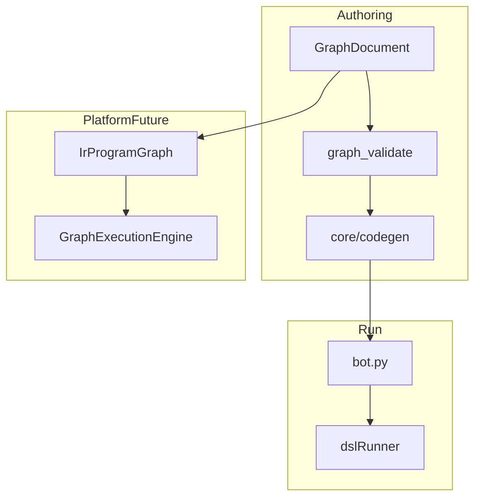

# Architecture Problems

## 1. Dual runtime (split-brain)

**Problem:** Studio runs Graph→Python on Node; Platform package still exposes DSL compile/execute APIs that call removed parser.

**Consequence:** Engineers assume `platform/` is production path; it fails at `parse_dsl`.

**Direction:** Single source of truth: `GraphDocument` + `core/codegen` for authoring; Platform executes **lowered IR graph** only.

---

## 2. Three graph representations

| Representation | Used for |
|--------------|----------|
| `GraphDocument` (nodes map, edges map) | Editor state, persistence |
| Legacy `stacks[]` | Canvas render, cloud save, codegen input |
| React-flow-shaped `flow` | Codegen, examples, preview |

**Problem:** Constant conversion (`graphDocumentToStacks`, `stacksToGraphDocument`, `projectGraphToFlow`) with **lossy** edge→stack rules.

**Consequence:** Disappearing edges, branch layout bugs, repair mutates positions.

**Direction:** Canvas reads `GraphDocument` directly OR stacks become derived-only cache with explicit invalidation.

---

## 3. React Flow vs stack canvas

**Problem:** Product language says “React Flow”; implementation is custom `GraphCanvas` + stacks.

**Consequence:** Debugging wrong layer; `CicadaNode` dead; CSS hides RF edges globally.

**Direction:** Document “stack canvas”; remove RF artifacts or re-integrate RF as read-only overlay.

---

## 4. God modules

- `src/App.jsx` — auth, billing, canvas, AI, examples, tours
- `server.mjs` — API monolith
- `core/codegen/compileCore.js` — all block compilers

**Consequence:** High coupling, stale closures, effect ordering bugs (autosave vs example load).

---

## 5. Event-sourced graph without snapshot discipline

`migrateGraphDocument` clears and replays bootstrap ops — correct for load, but:

- No transactional UI rollback on partial replay failure
- `graph_revision` autosave races with example load (partially fixed)

---

## 6. Keyboard / callback two-phase compile

Rules → autoFix → AST → bind keyboards → callback map → emit Python.

**Problem:** Unit tests and mental model still assume per-block transpile.

**Direction:** Document pipeline stages in `core/codegen/README.md` (partially done).

---

## 7. Platform native_core import guard (fixed)

Import-time `ensure_legacy_path()` prevented **any** native module load — architectural mistake (guard at wrong layer).

---

## 8. Missing validation layer (partially fixed)

No schema validation on client load before mutate — allowed corrupt graphs into store.

Added `validateGraphDocumentForEditor`; server should mirror validation on project save.

---

## 9. Test / tooling gap

Python tools under `core/tests/tools/` incomplete — CI flaky on fresh clone.

---

## 10. cyclic dependency risk

- `block_catalog` → `blockRegistry` → codegen
- App imports catalog + graph + builder components circularly via context

No hard cycle detected in build (Vite succeeds); still fragile.

---

## Compatibility matrix (frontend ↔ backend)

| Feature | Frontend | Backend | Compatible |
|---------|----------|---------|------------|
| Save project | stacks JSON | `server.mjs` PG | ✅ |
| Run bot | Python code | `dslRunner.mjs` | ✅ |
| Preview | codegen snapshot | worker | ✅ |
| Platform execute graph | `engineClient` | `parse_dsl` stub | ❌ |
| Import .ccd | disabled | N/A | ✅ (intentional) |
| WebSocket graph sync | unclear/partial | — | ⚠️ verify |

---

## Recommended target architecture

Authoring and execution share **GraphDocument**; Platform ingests IR lowered from same graph, not DSL text.

---

## Update 2026-05-22

- Platform boundary now executes graph IR without DSL payload in API routes.
- `GraphDocument` contracts moved to zod schemas (`src/constructor/graph_document/contracts.js`).
- Persist/import/export path switched to GraphDocument payloads (`graph_document`) with preflight validation.
- Remaining architectural hotspot: monolithic `App.jsx` + stack-centric UI interaction model.
