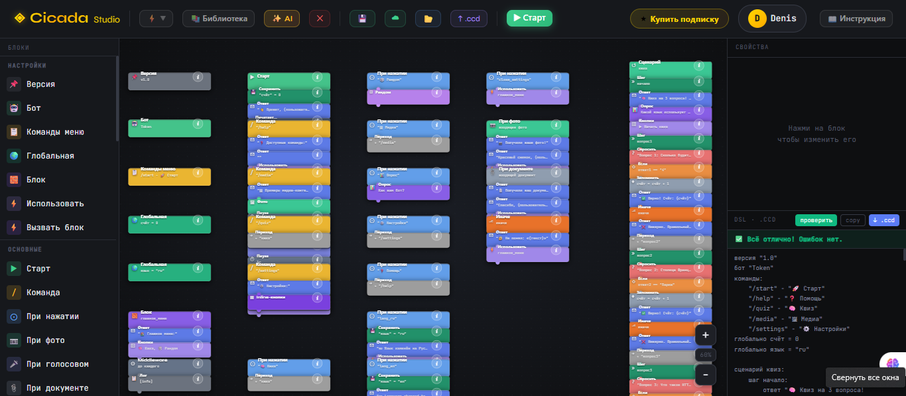

<div align="center">



<br/>

# ✦ Cicada Studio

### Конструктор Telegram-ботов на графе блоков и Cicada DSL

**Опиши бота словами или собери на холсте — получи рабочий Telegram-бот на aiogram 3.**  
Без ручного кода. Прямо из браузера.

<br/>

[](https://nodejs.org)
[](https://react.dev)
[](core/)
[](platform/)
[](https://postgresql.org)
[](https://docker.com)
[](LICENSE)

<br/>

</div>

---

## ✦ Killer Feature — AI → Telegram Bot

Напишите по-русски, что должен делать бот — Studio построит **граф блоков** и сгенерирует **Python (aiogram 3)** для запуска:

```
"Создай бота для кофейни: приветствие, меню с 5 позициями,
 кнопка заказа, QR-код для оплаты, FAQ"
```

↓ **за несколько секунд** ↓

- визуальный граф на холсте (React Flow);
- preview-код `bot.py` через ядро **`core/codegen`**;
- запуск в Telegram через песочницу (`services/dslRunner.mjs` + CLI `cicada` / Python venv).

Текстовый **Cicada DSL** по-прежнему поддерживается в панели DSL и для AI-экспорта, но **единственный execution target превью и экспорта конструктора — aiogram 3**, не legacy `.ccd`.

---

## ⚡ Что такое Cicada Studio

**Cicada Studio** — платформа для создания, запуска и управления Telegram-ботами: визуальный конструктор, облачные проекты в PostgreSQL, админка и опционально ESPHome.

| Компонент | Описание |
|---|---|
| 🧩 **Ядро `core/`** | Graph JSON → AST → **aiogram 3** (`compileGraphToPython`), IDE-парсер, AI IR (intent → graph), `core:guard` при сборке |
| 🐍 **Cicada Platform `platform/`** | Новый модульный runtime: DSL → AST → IR → async executor, transport plugins, sandbox (миграция с legacy CLI) |
| 🎨 **Конструктор `src/`** | React 18 + Vite, React Flow, staged validation, библиотека модулей |
| 🤖 **AI** | GROQ / Anthropic / Ollama — генерация графа и DSL из текста |
| ▶️ **Запуск бота** | `services/dslRunner.mjs` — изолированный процесс, лимиты CPU/RAM/времени |
| ☁️ **Облако** | PostgreSQL: проекты, пользователи, подписки |
| 🔌 **ESPHome** | `/esphome/`, сборка прошивок ESP32/ESP8266 на сервере |
| 🛠️ **Webinstall** | `webinstall.py` — монитор, установка из `.env`, файловый менеджер (порт **7700**) |
| 👤 **Auth** | Email/пароль, Google OAuth, Telegram, JWT |
| 🛡️ **Admin** | `/satana` — пользователи, боты, безопасность, логи |

> Операционный гайд (порты, swap, webinstall API): **[READMI.md](READMI.md)** · **[readmi.txt](readmi.txt)**

---

## 🏗️ Архитектура ядра

```text
┌─────────────────────────────────────────────────────────────────┐
│  Browser: src/ (React Flow, ModuleLibrary, DSLPanel, Builder)    │
└────────────────────────────┬────────────────────────────────────┘
                             │ Graph JSON / API
┌────────────────────────────▼────────────────────────────────────┐
│  server.mjs (Express 5)                                          │
│  · auth, projects, admin, ESP build, AI routes                   │
│  · compile preview → core/compiler/codegen.ts                    │
│  · run bot → services/dslRunner.mjs                              │
└────────────┬───────────────────────────────┬──────────────────────┘
             │                               │
┌────────────▼──────────────┐   ┌────────────▼──────────────────────┐
│  core/ (TS/JS)            │   │  platform/ (Python, опционально)   │
│  · codegen → bot.py       │   │  · compiler + async RuntimeEngine  │
│  · ide/ parser, semantic  │   │  · transport.telegram, sandbox     │
│  · ai/ IR pipeline        │   │  · цель: заменить spawn CLI       │
│  · rules, manifests       │   │  · см. platform/docs/ARCHITECTURE  │
└───────────────────────────┘   └────────────────────────────────────┘
             │
             ▼
   .venv-bot / cicada CLI  →  Telegram API
```

### Слои `core/` (production path Studio)

| Путь | Назначение |
|------|------------|
| `core/codegen/` | Graph → stacks → `bot.py` (aiogram 3), `npm run core:guard` |
| `core/compiler/` | TypeScript entry `compileGraph` / sync API для server |
| `core/ide/` | Lexer, parser, semantic, LSP-провайдеры для DSL/редактора |
| `core/ai/` | IR: intent, repair, semantic gate, reconciler для AI-генерации |
| `core/graph/`, `core/ir/` | Нормализация flow, project IR v2 |
| `core/manifests/` | `api-manifest.json`, capabilities для палитры блоков |

Подробнее: [`core/codegen/README.md`](core/codegen/README.md), [`core/ide/README.md`](core/ide/README.md).

### `platform/` (новое ядро runtime)

Модульная event-driven платформа (Python 3.13+): **DSL → AST → IR → executor**, плагины transport/storage/sandbox.

```bash
cd platform
pip install -e ".[dev,telegram]"
set CICADA_GRAPH_NATIVE_MODE=1
cicada-platform serve --reload
pytest tests/parity -q
```

Документация: [`platform/README.md`](platform/README.md), [`platform/docs/ARCHITECTURE.md`](platform/docs/ARCHITECTURE.md).

---

## 🧬 Язык Cicada DSL

Cicada DSL — декларативный русскоязычный синтаксис для сценариев ботов. Используется в DSL-панели, AI-экспорте и legacy-запуске через CLI `cicada-studio` (PyPI).

### Основные конструкции

```cicada
бот "TG_BOT_TOKEN"

при старте:
    ответ "Привет, {пользователь.имя}!"
    кнопки "📦 Каталог" "💬 Поддержка"

сценарий регистрация:
    шаг имя:
        спросить "Как вас зовут?" → user_name
    шаг готово:
        ответ "Готово, {user_name} ✅"
        завершить сценарий

при нажатии "🌤 Погода":
    http_get "https://wttr.in/Moscow?format=3" json weather_data → result
    ответ "Погода: {result}"
```

### Возможности

- Кнопки (inline / reply), FSM (`сценарий` + `шаг`)
- Переменные (`сохранить`, `получить`), `если` / `иначе`
- HTTP, шаблоны `{переменная}`, системные поля пользователя

Примеры: [`docs/examples/`](docs/examples/).

---

## 🎛️ Визуальный конструктор

Редактор на **React Flow** (`@xyflow/react`): блоки, порты, staged validation, синхронизация с DSL-панелью.

```
┌─────────────────┬────────────────────┬──────────────────┐
│   Палитра       │   Граф (холст)     │  Свойства / код  │
│   модулей       │   узлы + рёбра     │  Python preview  │
└─────────────────┴────────────────────┴──────────────────┘
```

**Возможности:**

- Drag-and-drop, zoom/pan, авто-связи
- **Preview Python** — `core/codegen` → aiogram 3 (ошибки в UI)
- Проверка графа, подсказки, библиотека builtin-модулей (`src/modules/builtin/`)
- Экспорт проекта, облачное сохранение
- AI: текст → IR → граф (см. `core/ai/`)

Ключевые каталоги: `src/constructor/`, `src/builder/`, `src/ModuleLibrary.jsx`.

---

## 🛡️ Безопасность

### Аутентификация

- **bcrypt** для паролей, **JWT** + cookie-session
- **Google OAuth**, Telegram OAuth (`HMAC-SHA256`)
- Rate limiting на auth-роутах
- **`AUTH_BYPASS=1`** только в `NODE_ENV=development` (LOCAL / Termux)

### DSL / Python sandbox

Запуск бота — отдельный процесс с лимитами:

| Лимит | По умолчанию | Переменная |
|---|---|---|
| Время | 5 мин | `DSL_MAX_RUNTIME_MS` |
| Размер кода | 100 КБ | `DSL_MAX_CODE_BYTES` |
| Логи | 80 000 симв. | `DSL_MAX_LOG_CHARS` |

На Linux — **bubblewrap** (`DSL_SANDBOX_MODE`, `bootstrap.sh` ставит пакет).

### Admin (`/satana`)

- `ADMIN_KEY` (≥16 символов), опционально **TOTP** и **WebAuthn / Passkey**
- `timingSafeEqual`, аудит действий
- В API клиенту — только короткие `error`; детали в серверных логах

### AI Debug IDE (`/debug.html`)

- Локально: `npm run dev:full` (`NODE_ENV=development`)
- На production-домене: `DEV_IDE_ADMIN=1` в `.env`, затем вход через **`/admin`** (тот же `admin_session` / JWT админа). Без сессии API отвечает **403**

---

## 🖥️ Admin-панель

**`/satana`** — деньги (CryptoBot), пользователи, боты, безопасность (`GROQ_TOKEN` 1–3), системные логи, WebAuthn.

Первый вход: `ADMIN_KEY` (+ `ADMIN_TOTP_SECRET` при необходимости). Secure context: `https://` или `http://localhost`.

---

## 🚀 Быстрый старт

### Требования

- **Node.js 20+**, **npm**
- **PostgreSQL 14+**
- **Python 3.10+** — venv бота (`.venv-bot`), опционально `pip install cicada-studio`
- Токен [@BotFather](https://t.me/BotFather)
- AI: **GROQ** / **Anthropic** / **Ollama** — см. `env.example`

### Локальная разработка

```bash
git clone https://github.com/Cicadadenis/tg-constructor.git
cd tg-constructor

npm install
cp env.example .env
# заполните JWT_SECRET, ADMIN_KEY, DB_*, TG_BOT_TOKEN

npm run dev          # UI → http://localhost:5173
npm run server:dev   # API → http://localhost:3001
```

Проверки:

```bash
npm run check:server
npm run core:guard
npm run build
npm run test:compiler
```

### VPS / WSL — webinstall (рекомендуется)

Веб-панель без ручного ввода в терминале:

```bash
cd /path/to/tg-constructor
git pull
sudo python3 webinstall.py
```

Откройте URL из консоли (порт **7700** по умолчанию, может сдвинуться на 7701…):

```text
http://IP_СЕРВЕРА:7700/
```

| Вкладка | Функция |
|---------|---------|
| **Монитор** | CPU, RAM, swap, процессы |
| **Установка** | Форма или загрузка `.env` → `setup.sh --webinstall` (SSE-логи) |
| **Файлы** | Просмотр/редактирование проекта (`.env` скрыт) |

Переменные: `WEBINSTALL_PORT`, `WEBINSTALL_PUBLIC_URL`. Подробно: **[READMI.md](READMI.md)** / **[readmi.txt](readmi.txt)**.

Установка без UI:

```bash
python3 webinstall.py --direct
```

### Автоустановка — `bootstrap.sh` / `setup.sh`

```bash
chmod +x bootstrap.sh
sudo bash bootstrap.sh
# Termux:
bash scripts/termux-setup.sh
```

Скрипт: Node 20, PM2, PostgreSQL, Nginx (не Termux), bubblewrap, `cicada-studio`, опционально ESPHome в `.venv-esphome`, `.env`, PROD SSL или LOCAL self-signed.

**LOCAL (WSL/VPS):** `denisbednakov@gmail.com` / `cicada3301`, `AUTH_BYPASS=1`.  
**Termux:** LOCAL, без ESPHome/nginx, API `http://127.0.0.1:3001`.

```bash
sudo CICADA_TG_PIN=0.0.1 ESPHOME_PIN=2024.12.0 bash bootstrap.sh
```

### Docker

```bash
docker-compose up -d
docker-compose logs -f app
```

---

## ⚙️ Переменные окружения

Шаблон: **`env.example`**. Кратко:

```env
# Сервер
NODE_ENV=production
API_HOST=0.0.0.0
API_PORT=3001
APP_URL=https://example.com

# БД
DB_HOST=localhost
DB_NAME=cicada
DB_USER=cicada_user
DB_PASSWORD=...

# Auth / admin
JWT_SECRET=...          # ≥32 в production
ADMIN_KEY=...
LE_EMAIL=admin@example.com   # PROD + Let's Encrypt (webinstall подставит из ADMIN_EMAIL)

# Telegram / AI
TG_BOT_TOKEN=...
GROQ_TOKEN=...
ANTHROPIC_API_KEY=...

# Python бота
PYTHON_BIN=python3
BOT_PYTHON_VENV=.venv-bot
CICADA_BIN=/usr/local/bin/cicada

# Sandbox
DSL_SANDBOX_MODE=enforced
DSL_SANDBOX_NETWORK=host
DSL_MAX_RUNTIME_MS=300000

# ESPHome (опционально)
ESPHOME_BIN=.../.venv-esphome/bin/esphome
```

Vite: `VITE_API_URL`, `VITE_API_TARGET`, `VITE_ADMIN_EMAIL`, `VITE_TG_BOT_NAME`.

---

## 📁 Структура проекта

```text
tg-constructor/
├── src/                      # Frontend (React + Vite)
│   ├── constructor/          # Graph document, orchestrator, preview bridge
│   ├── builder/              # Python pane, diagnostics, compile hooks
│   ├── modules/builtin/      # Готовые блоки (FAQ, QR, DB, …)
│   ├── App.jsx, ModuleLibrary.jsx, DSLPanel.jsx
│   └── vite.config.js        # (корневой vite.config.js)
├── core/                     # Ядро Studio (TS/JS)
│   ├── codegen/              # Graph → aiogram 3 Python
│   ├── compiler/             # compileGraph API
│   ├── ide/                  # Parser, semantic, LSP
│   ├── ai/                   # IR pipeline для AI
│   ├── graph/, ir/, rules/
│   └── manifests/
├── platform/                 # Cicada Platform (Python runtime)
│   └── src/cicada_platform/
├── services/
│   ├── dslRunner.mjs         # Запуск бота в sandbox
│   ├── compiler/previewCompiler.mjs
│   └── espFirmware.mjs, espBuildJobServer.mjs
├── server.mjs                # Express API
├── webinstall.py             # Панель :7700
├── webinstall/index.html
├── public/esphome/, public/flash/
├── bootstrap.sh, setup.sh
├── scripts/                  # core-guard, termux-setup, file_encrypt
├── docker-compose.yml
├── env.example
├── README.md                 # этот файл
├── READMI.md                 # operational guide (полный)
└── readmi.txt                # operational guide (краткий .txt)
```

---

## 🔧 Разработка

```bash
npm run dev              # Vite UI
npm run server:dev       # API + hot reload env
npm run build            # core:guard + vite build
npm run core:guard       # запрет legacy cic-st-core / dslCodegen в prod build
npm run test:compiler
npm run test:runtime
npm run lint
npm run typecheck
npm run ci:codegen
```

### CI

GitHub Actions (`main`): `npm ci` → `check:server` → `core:guard` → `build`.

---

## 🗺️ Roadmap

### В работе

- [x] Graph → aiogram 3 codegen (`core/codegen`, `core:guard`)
- [x] Webinstall: монитор, `.env`, файловый менеджер
- [ ] Полная миграция `dslRunner` → `platform/` sandbox API
- [ ] Graph → IR → platform executor без legacy CLI

### v1.2 — Продукт

- [ ] Webhook CryptoBot + автопродление подписок
- [ ] Аналитика DAU / retention
- [ ] Экспорт ZIP / self-hosted bundle

### v1.3 — AI

- [ ] AI-объяснение ошибок графа и Python preview
- [ ] Автодополнение в DSL (LSP из `core/ide`)

### v2.0

- [ ] Маркетплейс шаблонов
- [ ] Webhooks для внешних систем

---

## 🧑‍💻 Технологический стек

| Слой | Технология |
|---|---|
| **Frontend** | React 18, Vite 5, React Flow 12 |
| **Core** | TypeScript 6, Graph codegen → **aiogram 3** |
| **Backend** | Node.js 20, Express 5, `tsx` |
| **Platform** | Python 3.13, FastAPI, Pydantic v2 (миграция) |
| **Database** | PostgreSQL 16, `pg` |
| **Auth** | JWT, bcryptjs, Passport Google |
| **AI** | GROQ, Anthropic, Ollama |
| **IoT** | ESPHome, PlatformIO, Web Serial |
| **Ops** | Docker, PM2, `bootstrap.sh`, **`webinstall.py`** |
| **Security** | helmet, rate-limit, bubblewrap, CORS |

---

## 📄 Лицензия

MIT © 2026 [Cicada3301](https://github.com/Cicadadenis)

---

<div align="center">

**Cicada Studio** — Telegram-боты на **графе**, **Cicada DSL** и ядре **core/platform**

*Сделано с ♥ для автоматизации без программирования*

</div>
