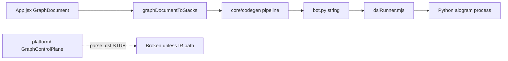

# Root Cause Analysis — Cicada Studio Production Audit

**Date:** 2026-05-22  
**Scope:** Full recursive audit (frontend constructor, `core/codegen`, Node `server.mjs`, `platform/` Python package)

---

## Executive summary

The **Node/React constructor path is largely migrated** to Graph → aiogram 3 Python (`core/codegen`, `services/dslRunner.mjs`). Legacy **`cic-st-core` and `.ccd` runtime are removed** from the repo (`scripts/core-guard.mjs` enforces this). Remaining pain is **split-brain documentation**, **platform Python DSL stubs**, and **UI graph projection bugs** that look like “React Flow / missing blocks” but are actually **stack viewport + migration** issues.

---

## P0 — Examples appear broken / bots not selectable

| Symptom | Root cause | Evidence |
|---------|------------|----------|
| Example loads but canvas looks empty | Example graphs use **multi-column layout** with large Y offsets; viewport stays at `(0,0)` | `helpers.js` `COL_Y_STRIDE` (was 1000); bot at y=20, handlers at y≈1120+ |
| Example “reverts” after login | `canvasStorageKey` effect reloads **localStorage autosave** on user change | `App.jsx` ~1231–1252 |
| Silent failed load | `migrateGraphDocument` result **never checked** | `loadExampleGraph` before fix |
| Callback repair reshuffles layout | `graphDocumentWithRepairedCallbacks` → `stacksToGraphDocument` **recomputes positions** | `core/graph/model.js` `projectGraphFromLegacyStacks` |

**Fix applied:** validate document, check migrate `ok`, `skipNextCanvasSave`, skip one-shot callback repair for examples, `computeViewportForStacks`, reduce `COL_Y_STRIDE` to 320.

---

## P0 — Palette shows “old” or wrong blocks

| Symptom | Root cause |
|---------|------------|
| Sidebar correct but drag ghost wrong | `cachedDefaultProps` frozen for process lifetime; `BUILDER_UI_DEFAULT_PROPS` lists legacy types |
| Blocks in “Прочее” | Registry `group` ≠ `paletteSidebarSectionOrder` in `graph_ui_palette.js` |
| Metadata stale in dev | `GRAPH_UI_NODE_METADATA` computed once at module load |

**Fix applied:** invalidate default props cache in DEV; documented dual gate (registry + `AIOGRAM3_BLOCK_FLOW_META`).

---

## P0 — Blocks “disappear” on canvas

| Symptom | Root cause |
|---------|------------|
| Nodes missing visually | **Canvas renders `stacksView` only**, not React Flow `projection.nodes` | `GraphCanvas.jsx` |
| Branches look wrong | `projectGraphToLegacyStacks` follows **first outgoing edge only** per chain | `core/graph/model.js:212` |
| Edges missing | Invalid edge endpoints dropped in `createGraphDocument` / serializer | `graph_document.js:35–39` |

`CicadaNode.jsx` / React Flow CSS remain for legacy/preview paths; **editor is stack-based**.

---

## P0 — Platform graph execute broken

| Symptom | Root cause |
|---------|------------|
| `POST` constructor execute raises immediately | `parse_dsl` → `ensure_legacy_path()` stub | `compiler/legacy_bridge.py` |
| Import `native_core` fails | `ensure_legacy_path()` at **import time** | `runtime/native_core/__init__.py` |
| `GraphControlPlane.__init__` fails | Called `ensure_legacy_path()` even when graph already loaded | `graph_control_plane.py` |

**Fix applied:** remove import-time and `__init__` legacy guards; `from_dsl` still broken by design until IR-only path.

---

## P1 — Codegen / tests drift

| Issue | Root cause |
|-------|------------|
| `buttons`/`inline` unit tests fail | Keyboards emit at **AST bind** phase; standalone `compileButtons()` returns `''` | `compileCore.js:319–325` |
| `fixed.aborted === false` fails | Success path omitted `aborted` field | `pipeline.js` return |
| build-graph / validate_ast tests fail | **`core/tests/tools/*.py` missing** from repo | CI/local 9 failures |

**Fix applied:** update tests; add `canonical_ast_json.py`; skip tests when tools missing.

---

## P1 — DSL legacy not fully deleted from product surface

- **Removed from runtime:** `cic-st-core`, `.ccd` files, `dslCodegen.js`, `generateDslFromProjectGraph` (throws).
- **Still present:** `core/ai/llmOutput.js` (.ccd linter), `core/dslCondition.js`, marketing copy, `type: 'cicada'` canvas wrapper (not DSL VM).
- **Misnamed:** `core/stacksToDsl.js` → re-exports Python codegen; `services/dslRunner.mjs` → Python spawn.

---

## Architecture diagram (actual production path)

---

## Recommended verification

1. Load each example from **Примеры** — all stacks visible, viewport fitted.
2. `npm run build` + `node --test` in `core/`.
3. Do not call platform `/v1/compile` or constructor `execute` with DSL body until IR migration completes.

---

## Update 2026-05-22 (IR-only cleanup)

- Removed `projectGraphToLegacyStacks` / `projectGraphFromLegacyStacks` from `core/graph/model.js`.
- Removed platform DSL entrypoints: `/v1/compile`, `parse_dsl()` usage in runtime routes, runtime `legacy_bridge.py`.
- Switched project persistence API payload from `stacks` to `graph_document`.
- Added production `validateGraph(graph)` with checks for schema mismatch, cycles, invalid edges, callbacks, FSM links, references, viewport.
- Added zod contracts for GraphDocument/export/operation/AST/codegen snapshot.
