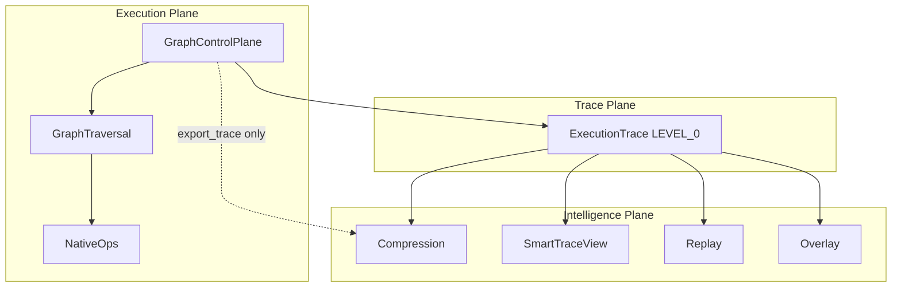

# Architecture Layer Model (Final)

Deterministic **layered execution system** with strict one-way dependencies.

## Planes

### 1. Execution plane

**Purpose:** Run the bot — route updates, traverse graph, execute NativeOps, suspend/resume.

| Component | Role |
|-----------|------|
| `GraphControlPlane` | Facade |
| `GraphRouter` | Inbound routing |
| `GraphTraversal` | DAG walk, `run_native_op` gateway |
| `GraphResume` | Suspend/resume |
| `GraphScenarios` | Scenario steps |
| `NativeOpRegistry` / `native_core` | Effects and state primitives |

**Outputs:** side effects + append-only `ExecutionTrace.emit()` calls.

**Does not:** compress traces, build summaries, replay offline, or import intelligence (except allowlisted export delegate).

---

### 2. Trace plane

**Purpose:** Canonical **LEVEL_0** event log per `handle_update`.

| Module | Role |
|--------|------|
| `runtime/trace.py` | `TraceEvent`, `ExecutionTrace`, observers |

**Properties:**

- Ordered `seq`, immutable contract surface
- No interpretation logic
- No intelligence imports
- Bootstrap hook for passive observers (registered by intelligence at import)

**Source of truth:** `ExecutionTrace.events`

---

### 3. Intelligence plane

**Purpose:** Scale human and tooling comprehension without becoming a second engine.

| Module | Role |
|--------|------|
| `trace_compression` | Lossless LEVEL_1 grouping |
| `trace_view` | LEVEL_1/2 SmartTraceView |
| `performance_overlay` | Post-exec annotations |
| `trace_diff` | A/B comparison |
| `replay` | LEVEL_0 walk (no NativeOps) |
| `trace_inspector` | Tooling facade |

**Properties:**

- Pure functions over LEVEL_0 (modulo explicit test bootstrap)
- Read-only projections
- Never schedules, never calls NativeOps, never mutates traversal

---

## Dependency graph



Solid: runtime data flow. Dotted: allowlisted export delegate (still derived from LEVEL_0).

## Level model

| Level | Plane | Content |
|-------|-------|---------|
| LEVEL_0 | Trace | Raw `events` |
| LEVEL_1 | Intelligence | Condensed segments (lossless decompress) |
| LEVEL_2 | Intelligence | Human summary |

## Guarantees

1. **Deterministic execution** — graph + NativeOps authoritative; trace is audit log.
2. **No reverse dependencies** — enforced by `layer_separation_guard` + tests.
3. **Replay integrity** — replay engine reads `_trace.events` / `canonical_subset_events` only.
4. **Intelligence never authoritative** — cannot override execution outcomes.

## Environment flags

| Flag | Plane affected |
|------|----------------|
| `CICADA_GRAPH_NATIVE_MODE` | Execution |
| `CICADA_EXEC_TRACE_MODE` | Trace recording + intelligence export |
| `CICADA_EXEC_REPLAY_MODE` | Intelligence store |
| `CICADA_EXEC_PROFILE_MODE` | Intelligence hooks (annotation) |

## Contracts

- [LAYER_SEPARATION_CONTRACT.md](./LAYER_SEPARATION_CONTRACT.md) — import boundaries
- [TRACE_TRUTH_CONTRACT.md](./TRACE_TRUTH_CONTRACT.md) — lossless / replay truth
- [EXECUTION_EQUIVALENCE_CONTRACT.md](./EXECUTION_EQUIVALENCE_CONTRACT.md) — semantic equivalence
- [SEMANTIC_MODEL_FINAL.md](./SEMANTIC_MODEL_FINAL.md) — authority / projection model
- [EXECUTION_SPEC.md](./EXECUTION_SPEC.md) — runtime semantics

## Verification

```bash
pytest tests/test_layer_separation.py tests/test_trace_truth_contract.py tests/test_execution_equivalence.py -q
```
