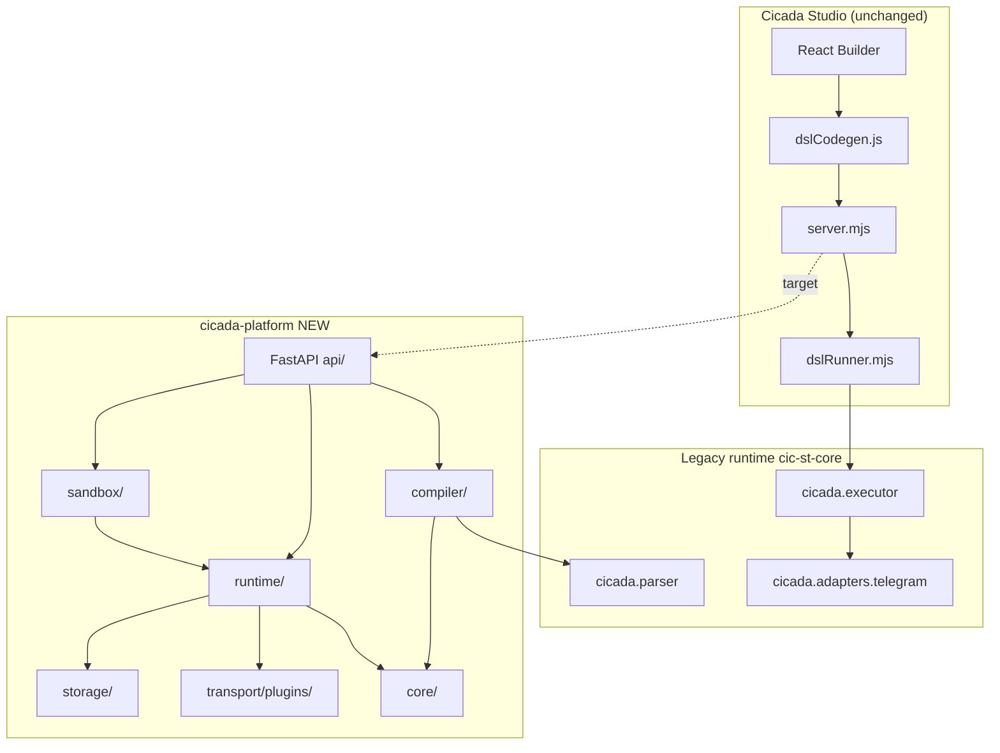

# Dependency Graph

```mermaid
flowchart TB
  subgraph Studio["Cicada Studio (unchanged)"]
    UI[React Builder]
    Codegen[dslCodegen.js]
    NodeAPI[server.mjs]
    DslRunner[dslRunner.mjs]
  end

  subgraph Legacy["Legacy runtime cic-st-core"]
    Parser[cicada.parser]
    Exec[cicada.executor]
    TgAd[cicada.adapters.telegram]
  end

  subgraph Platform["cicada-platform NEW"]
    API[FastAPI api/]
    Comp[compiler/]
    RT[runtime/]
    Core[core/]
    TR[transport/plugins/]
    SB[sandbox/]
    ST[storage/]
  end

  UI --> Codegen
  Codegen --> NodeAPI
  NodeAPI --> DslRunner
  DslRunner --> Exec
  Exec --> TgAd

  NodeAPI -.->|target| API
  API --> Comp
  Comp --> Parser
  Comp --> Core
  API --> RT
  RT --> Core
  RT --> TR
  API --> SB
  SB --> RT
  RT --> ST
```

**Rule:** `runtime` must not import `transport.plugins.telegram` directly — only `TransportRegistry` + DI.
